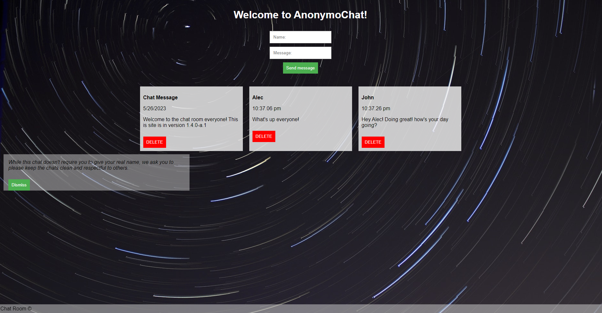

Welcome to AnonymoChat, basic explaination of how to use below!

AnonymoChat is a fullstack web application that sends and recieves messages
anonymously! This was made by Alec Wixom, for the purpose of having a temporary
saved database of messages between users. All data is saved to the db.json or /api/messages
as well as the database is cleared upon restarting the website or using the delete function.

DOWNLOADING:
1: go to https://github.com/alecwixom/CapstoneFirstHalfOfDevMountain
2: click the <>Code button
3: download zip
4: unzip file to Desktop
5: open folder using VSCode
6: open the terminal and run in gitbash "npm i"
7: open browser and go to localhost:4001
8: explore the website!

TIMEZONES:
If you are getting the incorrect time stamp on messages, go to 
controller.js. At the end of line 16 you can put "-(hours)" to resolve
for the difference in time.

HOSTING:
If you are hosting using AWS, you need to run your instance and
copy your public ip.
Paste the public ip on line 4 of main.js replacing localhost:4001-http://localhost:4001/api/messages
On the AWS, you will need to also run "npm i" or specify what download it needs by running
npm i "specified"
